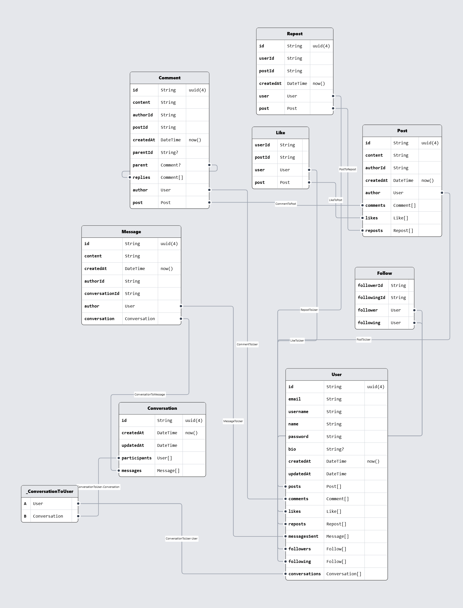
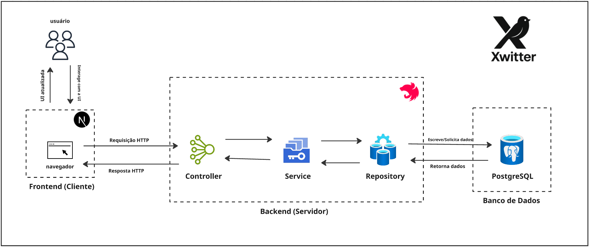

<div align="center">
  
</div>

# 🐦 Xwitter - Backend

Uma aplicação de rede social moderna inspirada no Twitter, desenvolvida com **NestJS** e totalmente containerizada com **Docker**. O projeto implementa funcionalidades essenciais de uma rede social, incluindo autenticação JWT, gerenciamento de usuários, posts, comentários, curtidas e sistema de seguidores.

## 🚀 Sobre o Projeto

Xwitter é um clone do Twitter que demonstra boas práticas de engenharia de software, incluindo:

- **Arquitetura Limpa**: DTOs, Services, Controllers e Guards bem organizados
- **Documentação Automática**: API totalmente documentada com Swagger/OpenAPI
- **Validação Robusta**: Validação de dados com class-validator
- **Segurança**: Autenticação JWT e autorização baseada em roles
- **DevOps**: Ambiente totalmente containerizado para desenvolvimento e produção

## 🛠️ Tecnologias

- **[NestJS](https://nestjs.com/)** - Framework Node.js progressivo
- **[TypeScript](https://www.typescriptlang.org/)** - JavaScript com tipagem estática
- **[Prisma](https://www.prisma.io/)** - ORM moderno para TypeScript
- **[PostgreSQL](https://www.postgresql.org/)** - Banco de dados relacional
- **[Docker](https://www.docker.com/)** - Containerização
- **[Swagger](https://swagger.io/)** - Documentação automática da API
- **[JWT](https://jwt.io/)** - Autenticação baseada em tokens
- **[class-validator](https://github.com/typestack/class-validator)** - Validação de dados


---

## 📊 Modelo do Banco de Dados

O diagrama lógico de dados representa os artefatos que constituem o banco de dados e seus relacionamentos e respectivas cardinalidades de forma visual.



[Ampliar](assets/dld-xwitter.png)

---

## 🏗️ Diagrama de Classes UML

Foram representados tanto o diagrama de classes da implementação do sistema dentro do NestJS quanto o relacionamento entre as entidades modeladas, no canto inferior direito.


[Ampliar.](assets/classes-xwitter.png)

---

## 📋 Quadro Kanban

[Acesse o Quadro Kanban para acompanhar o desenvolvimento histórias de usuário.](https://github.com/orgs/Xwitter-Social/projects/2)

---


## 🏗️ Arquitetura da Solução

O Xwitter foi desenvolvido seguindo os princípios de **Arquitetura Limpa** e **Domain-Driven Design (DDD)**, garantindo separação de responsabilidades, testabilidade e manutenibilidade.

<div align="center">
  
</div>

### 📋 Camadas da Arquitetura:

#### **🎯 Presentation Layer (Camada de Apresentação)**
- **Controllers**: Pontos de entrada HTTP/REST
- **Guards**: Validação de autenticação e autorização
- **DTOs**: Objetos de transferência de dados com validação
- **Swagger Decorators**: Documentação automática da API

#### **💼 Business Layer (Camada de Negócio)**
- **Services**: Lógica de negócio e regras da aplicação
- **Interfaces**: Contratos para repositórios e serviços
- **Utils**: Funções auxiliares e utilitários

#### **🗄️ Data Layer (Camada de Dados)**
- **Repositories**: Padrão Repository para acesso a dados
- **Prisma ORM**: Mapeamento objeto-relacional
- **Database**: PostgreSQL com conexões gerenciadas

#### **🔧 Infrastructure Layer (Camada de Infraestrutura)**
- **Docker**: Containerização da aplicação
- **JWT**: Sistema de autenticação com tokens
- **Environment Configuration**: Configuração por variáveis de ambiente

### 🔄 Fluxo de Dados:

1. **Request** → Controller recebe requisição HTTP
2. **Validation** → DTOs validam dados de entrada
3. **Authentication** → Guards verificam autenticação/autorização
4. **Business Logic** → Service processa regras de negócio
5. **Data Access** → Repository acessa dados via Prisma
6. **Response** → Dados retornados formatados via DTOs

---

## 🏃‍♂️ Como Executar

### Pré-requisitos

Certifique-se de ter instalado:
- [Git](https://git-scm.com/)
- [Docker](https://docs.docker.com/get-docker/)
- [Docker Compose](https://docs.docker.com/compose/install/)

> **📝 Nota:** Você **NÃO** precisa instalar Node.js, PostgreSQL ou qualquer outra dependência localmente!

### 🚀 Execução Rápida

```bash
# 1. Clone o repositório
git clone https://github.com/Xwitter-Social/backend-xwitter.git
cd backend-xwitter

# 2. Configure as variáveis de ambiente
cp .env.example .env

# 3. Execute o projeto (primeira vez)
docker-compose up --build
```

### ✨ O que acontece automaticamente:

1. 🏗️ **Builds da imagem Docker** com todas as dependências
2. 🗄️ **Inicia o PostgreSQL** com configurações otimizadas
3. ⏳ **Aguarda o banco estar disponível** (healthcheck automático)
4. 🔄 **Executa as migrações** automaticamente (via `prisma migrate deploy`)
5. ⚙️ **Gera o cliente Prisma** atualizado
6. 🎯 **Inicia a aplicação** em modo de desenvolvimento com hot-reload

### 🌐 Acesso

Após a inicialização, a aplicação estará disponível em:

- **API**: http://localhost:3001
- **Documentação (Swagger)**: http://localhost:3001/docs
- **Banco de dados**: localhost:5432

### 🔄 Execuções Subsequentes

```bash
# Para subir o ambiente (modo daemon)
docker-compose up -d

# Para visualizar logs
docker-compose logs -f backend

# Para parar
docker-compose down
```

---

## 🗄️ Gerenciamento do Banco de Dados

### Alterações no Schema

Quando você precisar alterar a estrutura do banco de dados:

```bash
# 1. Edite o arquivo prisma/schema.prisma

# 2. Gere e aplique a migração
docker-compose exec backend npx prisma migrate dev --name "nome-da-alteracao"

# 3. (Opcional) Visualize os dados
docker-compose exec backend npx prisma studio
```

### Reset do Banco (Desenvolvimento)

```bash
# ⚠️ CUIDADO: Remove todos os dados!
docker-compose exec backend npx prisma migrate reset --force
```

### Seed de Dados

```bash
# Execute o seed (se configurado)
docker-compose exec backend npx prisma db seed
```

---

## 🤝 Guia de Contribuição

### 🔧 Adicionando Dependências

Quando adicionar novas dependências Node.js:

```bash
# 1. Adicione a dependência normalmente
npm install nome-da-dependencia

# 2. Rebuilde o container para incluir a nova dependência
docker-compose build --no-cache backend

# 3. Reinicie os serviços
docker-compose up
```

### 📝 Alterações no Banco de Dados

Para mudanças no schema do banco:

```bash
# 1. Modifique prisma/schema.prisma
# 2. Gere a migração
docker-compose exec backend npx prisma migrate dev --name "descricao-da-mudanca"
# 3. Commit tanto o schema quanto a migração
git add prisma/
git commit -m "feat: adiciona nova tabela X"
```

### 🧪 Executando Testes

```bash
# Testes unitários
docker-compose exec backend npm run test

# Testes com coverage
docker-compose exec backend npm run test:cov

# Testes e2e
docker-compose exec backend npm run test:e2e
```

### 📋 Padrões de Commit

Utiliza-se [Conventional Commits](https://www.conventionalcommits.org/):

```bash
feat: adiciona nova funcionalidade
fix: corrige bug específico  
docs: atualiza documentação
refactor: refatora código sem alterar funcionalidade
test: adiciona ou modifica testes
chore: mudanças de build, CI, dependências
```

### 🔍 Linting e Formatação

```bash
# Lint
docker-compose exec backend npm run lint

# Formatação
docker-compose exec backend npm run format
```

---

## 🛠️ Comandos Docker Úteis

### Desenvolvimento

```bash
# Ver logs em tempo real
docker-compose logs -f backend

# Acessar shell do container
docker-compose exec backend bash

# Rebuild forçado (após mudanças de dependência)
docker-compose build --no-cache backend

# Ver status dos containers
docker-compose ps
```

### Banco de Dados

```bash
# Acessar PostgreSQL diretamente
docker-compose exec db psql -U user -d twitter_db

# Backup do banco
docker-compose exec db pg_dump -U user twitter_db > backup.sql

# Restore do banco
cat backup.sql | docker-compose exec -T db psql -U user twitter_db
```

### Limpeza

```bash
# Remove containers, networks e volumes
docker-compose down -v

# Remove imagens não utilizadas
docker system prune -a
```

---

## 📚 Estrutura Atual do Projeto

```
├── prisma/                    # Schema e migrações do banco
├── src/
│   ├── auth/                  # Módulo de autenticação
│   ├── user/                  # Módulo de usuários
│   ├── common/                # DTOs, decorators e utils compartilhados
│   └── database/              # Configuração do Prisma
├── scripts/                   # Scripts Docker e utilidades
├── docker-compose.yml         # Orquestração dos containers
├── Dockerfile                 # Imagem da aplicação
└── README.md                  # Este arquivo
```

---

## 🤔 Problemas Frequentes

### O banco não está conectando
- Verifique se o PostgreSQL subiu corretamente: `docker-compose logs db`
- Confirme se as variáveis de ambiente estão corretas

### Erro de permissão no Docker
```bash
sudo usermod -aG docker $USER
# Depois faça logout/login
```

### Container não reconhece novas dependências
```bash
docker-compose build --no-cache backend
docker-compose up
```

### Reset completo do ambiente
```bash
docker-compose down -v
docker system prune -a
docker-compose up --build
```


---
