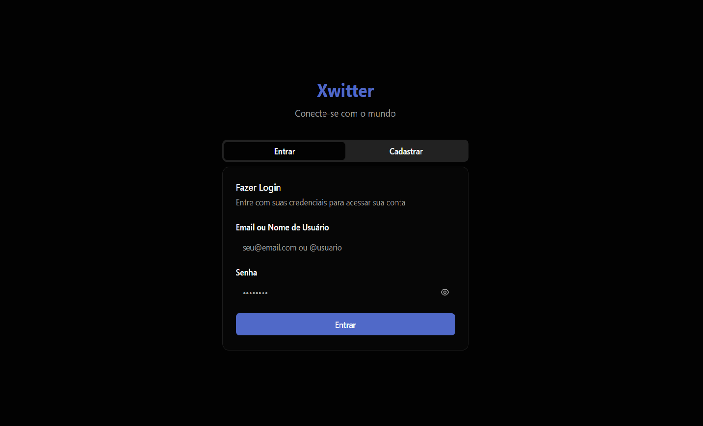
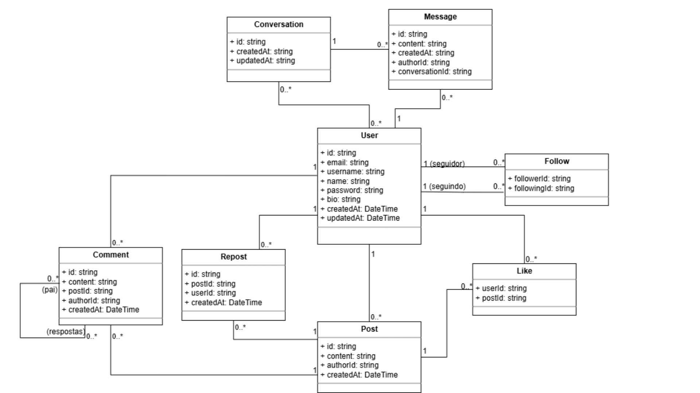

<div align="center">
  
</div>

# 🐦 Xwitter - Backend

Uma aplicação de rede social moderna inspirada no Twitter, desenvolvida com **NestJS** e totalmente containerizada com **Docker**. O projeto implementa funcionalidades essenciais de uma rede social, incluindo autenticação JWT, gerenciamento de usuários, posts, comentários, curtidas e sistema de seguidores.

## 🚀 Sobre o Projeto

Xwitter é um clone do Twitter que demonstra boas práticas de engenharia de software, incluindo:

- **Arquitetura Limpa**: DTOs, Services, Controllers e Guards bem organizados
- **Documentação Automática**: API totalmente documentada com Swagger/OpenAPI
- **Validação Robusta**: Validação de dados com class-validator
- **Segurança**: Autenticação JWT e autorização baseada em roles
- **DevOps**: Ambiente totalmente containerizado para desenvolvimento e produção

## 🛠️ Tecnologias

- **[NestJS](https://nestjs.com/)** - Framework Node.js progressivo
- **[TypeScript](https://www.typescriptlang.org/)** - JavaScript com tipagem estática
- **[Prisma](https://www.prisma.io/)** - ORM moderno para TypeScript
- **[PostgreSQL](https://www.postgresql.org/)** - Banco de dados relacional
- **[Docker](https://www.docker.com/)** - Containerização
- **[Swagger](https://swagger.io/)** - Documentação automática da API
- **[JWT](https://jwt.io/)** - Autenticação baseada em tokens
- **[class-validator](https://github.com/typestack/class-validator)** - Validação de dados

---

## 🌆 Protótipo

Clique na imagem abaixo para acessar o protótipo de todas as telas do Xwitter!

[](assets/telas-xwitter.pdf)

---

## 📊 Modelo do Banco de Dados

O diagrama lógico de dados representa os artefatos que constituem o banco de dados e seus relacionamentos e respectivas cardinalidades de forma visual.


[Ampliar](assets/dld-xwitter.png)

---

## 🏗️ Diagrama de Classes UML

Foram representados tanto o diagrama de classes da implementação do sistema dentro do NestJS quanto o relacionamento entre as entidades modeladas, no canto inferior direito.

### Diagrama de Classes Geral do Xwitter (implementação + entidades)

[](assets/classes-implementacao.png)

[Ampliar.](assets/classes-implementacao.png)

### Diagrama de Classes das Entidades do Xwitter



[Ampliar.](assets/classes-xwitter-escopo.png)

---

## 📋 Quadro Kanban

[Acesse o Quadro Kanban para acompanhar o desenvolvimento histórias de usuário.](https://github.com/orgs/Xwitter-Social/projects/2)

---

## 🏗️ Arquitetura da Solução

O Xwitter foi desenvolvido seguindo os princípios de **Arquitetura Limpa** e **Domain-Driven Design (DDD)**, garantindo separação de responsabilidades, testabilidade e manutenibilidade.

<div align="center">
  
</div>

### 📋 Camadas da Arquitetura:

#### **🎯 Presentation Layer (Camada de Apresentação)**

- **Controllers**: Pontos de entrada HTTP/REST
- **Guards**: Validação de autenticação e autorização
- **DTOs**: Objetos de transferência de dados com validação
- **Swagger Decorators**: Documentação automática da API

#### **💼 Business Layer (Camada de Negócio)**

- **Services**: Lógica de negócio e regras da aplicação
- **Interfaces**: Contratos para repositórios e serviços
- **Utils**: Funções auxiliares e utilitários

#### **🗄️ Data Layer (Camada de Dados)**

- **Repositories**: Padrão Repository para acesso a dados
- **Prisma ORM**: Mapeamento objeto-relacional
- **Database**: PostgreSQL com conexões gerenciadas

#### **🔧 Infrastructure Layer (Camada de Infraestrutura)**

- **Docker**: Containerização da aplicação
- **JWT**: Sistema de autenticação com tokens
- **Environment Configuration**: Configuração por variáveis de ambiente

### 🔄 Fluxo de Dados:

1. **Request** → Controller recebe requisição HTTP
2. **Validation** → DTOs validam dados de entrada
3. **Authentication** → Guards verificam autenticação/autorização
4. **Business Logic** → Service processa regras de negócio
5. **Data Access** → Repository acessa dados via Prisma
6. **Response** → Dados retornados formatados via DTOs

---

## 🏃‍♂️ Como Executar

### Pré-requisitos

Certifique-se de ter instalado:

- [Git](https://git-scm.com/)
- [Docker](https://docs.docker.com/get-docker/)
- [Docker Compose](https://docs.docker.com/compose/install/)

> **📝 Nota:** Você **NÃO** precisa instalar Node.js, PostgreSQL ou qualquer outra dependência localmente!

### 🚀 Execução Rápida

```bash
# 1. Clone o repositório
git clone https://github.com/Xwitter-Social/backend-xwitter.git
cd backend-xwitter

# 2. Configure as variáveis de ambiente
cp .env.example .env

# 2.1 Configure as variáveis de ambiente para testes de integração
cp .env.test.example .env.test
# a URL padrão já aponta para o schema "test" (postgresql://.../twitter_db?schema=test)
# mantenha esse schema ou utilize um database com sufixo _test para evitar limpar dados de desenvolvimento

# 3. Execute o projeto (primeira vez) - Os testes de integração e unitários serão executados automaticamente
docker-compose up --build

# 4. (Opcional) Execute os testes de forma visível
docker-compose up --build tests

```

> 💡 **Usando Docker:** O serviço `tests` do `docker-compose` já utiliza `npm run test`, garantindo a execução de testes unitários e de integração sempre que o ambiente de testes for iniciado.

Após a inicialização, a aplicação estará disponível em:

- **API**: http://localhost:3001
- **Documentação (Swagger)**: http://localhost:3001/docs
- **Banco de dados**: localhost:5432

### 🧪 Banco para Testes de Integração

Os testes de integração executam contra um banco PostgreSQL real. Garanta que o arquivo `.env.test` (criado a partir do `.env.test.example`) esteja presente com a variável `TEST_DATABASE_URL` apontando para um banco isolado. Utilize preferencialmente `schema=test` (já definido por padrão) ou um banco com sufixo `_test`. Para execução **local**, aponte essa URL para `localhost`. Ao rodar via `docker compose`, esse valor é sobrescrito automaticamente para utilizar o hostname interno `db`, mas o schema/test database dedicado permanece o mesmo.

> ⚠️ Por segurança, a suíte de integração bloqueia a limpeza do banco caso `TEST_DATABASE_URL` aponte para o schema `public` ou para o banco principal. Ajuste o schema ou nome do banco antes de rodar os testes.

Se estiver usando o banco provisionado pelo `docker compose`, garanta que o serviço `db` esteja no ar:

```bash
docker compose up -d db

```

> ✅ A URL usada nos testes é passada automaticamente para o Prisma. O script de `globalSetup` executa `prisma migrate deploy` e limpa as tabelas antes da suíte iniciar.

### 🔄 Execuções Subsequentes

```bash
# Para subir o ambiente (modo daemon)
docker-compose up -d

# Para visualizar logs
docker-compose logs -f backend

# Para rodar os testes unitários e de integração e ver o output no terminal
docker-compose up tests

# Para parar
docker-compose down
```

---

## 🗄️ Gerenciamento do Banco de Dados

### Alterações no Schema

Quando você precisar alterar a estrutura do banco de dados:

```bash
# 1. Edite o arquivo prisma/schema.prisma

# 2. Gere e aplique a migração
docker-compose exec backend npx prisma migrate dev --name "nome-da-alteracao"

# 3. (Opcional) Visualize os dados
docker-compose exec backend npx prisma studio
```

### Reset do Banco (Desenvolvimento)

```bash
# ⚠️ CUIDADO: Remove todos os dados!
docker-compose exec backend npx prisma migrate reset --force
```

### Seed de Dados

- ✅ **Seed automático no Docker**: sempre que o serviço `backend` sobe em modo de desenvolvimento (`NODE_ENV=development`), `prisma db seed` é executado automaticamente. Isso garante que exista um conjunto mínimo de usuários, posts, follows e uma conversa com mensagens para testar rapidamente.
- 🔧 **Desativar/forçar o seed**: defina a variável `ENABLE_STARTUP_SEED=false` no `docker-compose.yml` (ou no `.env`) caso não queira popular automaticamente. Em produção o seed é ignorado por padrão.
- 👥 **Credenciais padrão**:
  - `alice@xwitter.dev` / senha `xwitter123`
  - `bob@xwitter.dev` / senha `xwitter123`
  - `charlie@xwitter.dev` / senha `xwitter123`

Se preferir rodar manualmente, use o comando abaixo:

```bash
docker-compose exec backend npx prisma db seed
```

---

## 🤝 Guia de Contribuição

### 🔧 Adicionando Dependências

Quando adicionar novas dependências Node.js:

```bash
# 1. Adicione a dependência normalmente
npm install nome-da-dependencia

# 2. Rebuilde o container para incluir a nova dependência
docker-compose build --no-cache backend

# 3. Reinicie os serviços
docker-compose up
```

### 📝 Alterações no Banco de Dados

Para mudanças no schema do banco:

```bash
# 1. Modifique prisma/schema.prisma
# 2. Gere a migração
docker-compose exec backend npx prisma migrate dev --name "descricao-da-mudanca"
# 3. Commit tanto o schema quanto a migração
git add prisma/
git commit -m "feat: adiciona nova tabela X"
```

### 🧪 Executando Testes

Os testes são divididos em **unitários** e **de integração**. Ambos são executados automaticamente ao subir o ambiente via Docker Compose.

```bash
# Rodar os testes (unitários + integração) em um serviço dedicado
docker-compose up tests

# Ou rodar os testes localmente (fora do Docker)
npm run test

npm run test:unit       # Apenas testes unitários

npm run test:integration # Apenas testes de integração
```

### 📋 Padrões de Commit

Utiliza-se [Conventional Commits](https://www.conventionalcommits.org/):

```bash
feat: adiciona nova funcionalidade
fix: corrige bug específico
docs: atualiza documentação
refactor: refatora código sem alterar funcionalidade
test: adiciona ou modifica testes
chore: mudanças de build, CI, dependências
```

### 🔍 Linting e Formatação

```bash
# Verificar lint localmente (fora do Docker) - retorna erros/warnings se existirem
npm run lint

# Formatar o código localmente, corrigindo problemas automaticamente
npm run format

# Lint dentro do container Docker
docker-compose exec backend npm run lint

# Formatação dentro do container Docker
docker-compose exec backend npm run format
```

---

## 🛠️ Comandos Docker Úteis

### Desenvolvimento

```bash
# Ver logs em tempo real
docker-compose logs -f backend

# Acessar shell do container
docker-compose exec backend bash

# Rebuild forçado (após mudanças de dependência)
docker-compose build --no-cache backend

# Ver status dos containers
docker-compose ps
```

### Banco de Dados

```bash
# Acessar PostgreSQL diretamente
docker-compose exec db psql -U user -d twitter_db

# Backup do banco
docker-compose exec db pg_dump -U user twitter_db > backup.sql

# Restore do banco
cat backup.sql | docker-compose exec -T db psql -U user twitter_db
```

### Limpeza

```bash
# Remove containers, networks e volumes
docker-compose down -v

# Remove imagens não utilizadas
docker system prune -a
```

---

## 📚 Estrutura Atual do Projeto

```
├── Dockerfile
├── README.md
├── assets/                    # Logos, diagramas e materiais visuais
├── coverage/                  # Relatórios de cobertura gerados pelo Jest
├── docker-compose.yml         # Orquestração dos containers
├── generated/                 # Prisma Client gerado automaticamente
├── package.json
├── prisma/                    # Schema, migrations e seed do banco
│   ├── migrations/
│   ├── schema.prisma
│   └── seed.ts
├── scripts/                   # Scripts utilitários (ex.: entrypoint Docker)
├── src/
│   ├── app.module.ts          # Módulo raiz do NestJS
│   ├── main.ts                # Bootstrap da aplicação
│   ├── auth/                  # Autenticação (controllers, service, guard)
│   ├── common/                # Decorators e utilidades compartilhadas
│   ├── conversation/          # Conversas e mensagens privadas
│   ├── database/              # PrismaService e módulo de banco de dados
│   ├── interaction/           # Likes, follows, reposts e comentários
│   ├── post/                  # Publicações e timeline
│   └── user/                  # Usuários (perfil, busca, seguidores)
├── test/
│   ├── integration/           # Testes de integração por serviço
│   │   ├── utils/             # Prisma client compartilhado e fábricas
│   │   └── *.int-spec.ts
│   └── jest-e2e.json          # Configuração de testes e2e (placeholder)
├── tsconfig.json              # Configuração TypeScript
└── tsconfig.build.json        # Configuração para build NestJS
```

---

## 🤔 Problemas Frequentes

### O banco não está conectando

- Verifique se o PostgreSQL subiu corretamente: `docker-compose logs db`
- Confirme se as variáveis de ambiente estão corretas

### Erro de permissão no Docker

```bash
sudo usermod -aG docker $USER
# Depois faça logout/login
```

### Container não reconhece novas dependências

```bash
docker-compose build --no-cache backend
docker-compose up
```

### Reset completo do ambiente

```bash
docker-compose down -v
docker system prune -a
docker-compose up --build
```

---
